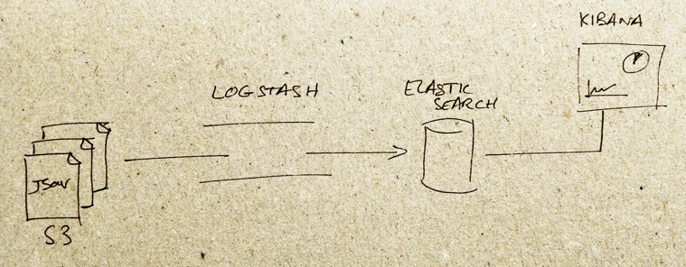
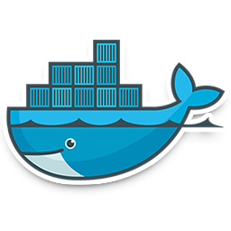

% Projecte 2016
% Centralització de logs JSON en BBDD i post-processat 
% Jordi Amela

# Introducció

A partir de la generació massiva de logs , són processats , guardats en una base de dades i finalment es visualitza.

---

# Estructura

Logstash --> Elasticsearch --> Kibana

---

# Logstash

## fitxer de configuració

[logstash.conf](https://github.com/jordii9/projecte/blob/master/configuracions/logstash/logstash.conf)

## Plugins

són funcionalitats que aporten caracteristiques noves

Poden ser: 

- defecte
- descargable

## Atributs

- Valors per defecte 
- Obligats (Required)

---

# Elasticsearch

- Configuració : `/etc/elasticsearch/elasticsearch.yml`
- Port : `9200`

## Funció

Base de dades (emmagatzematge)

## Index

Distribució de logs per indexs diaris

## Eines gràfiques

- `elastic-hq`
- `head`

---

# kibana

- Configuració :  `/opt/kibana/config/kibana.yml`
- Port :  `5601`

## Entorn gràfic

- Visualització
- Filtrat
- Gràfiques a temps real

---

# Tecnologia Docker

# Docker

## Idea

- Alliberar el host
- Funcionament de serveis automàtics
- Evitar problemes de compativilitat

## Funcionament

- Imatges
- Contenidor
- Cooperació 

## Dockerfile

Creació d'una immatge personalitzada

## Contenidor

[creació](https://github.com/jordii9/projecte/blob/master/docker/dockerfiles/script_docker.sh)

---

# Eines gràfiques

Elasticsearch

- localhost:9200/_plugin/hq/
- localhost:9200/_plugin/head/
	
Kibana

- localhost:5601

---

# Problemes principals

- Fitxer de configuració Logstash (plugin)
- Logstash container
- Volums i links
- Permisos dels fitxers

---

# Conclusió

- Creació de Documentació 
- Treballar amb l'entorn adient
- Tecnologia docker
- Creacó de presentacions html

# Opinió Personal

- Treball amb github
- Desenvolupar una tasca diferent individualment
- Utilització de noves eines a més de les apreses durant el curs

# Fi

Gràcies per la vostra atenció
